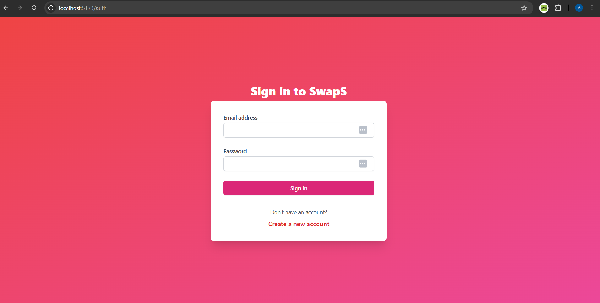
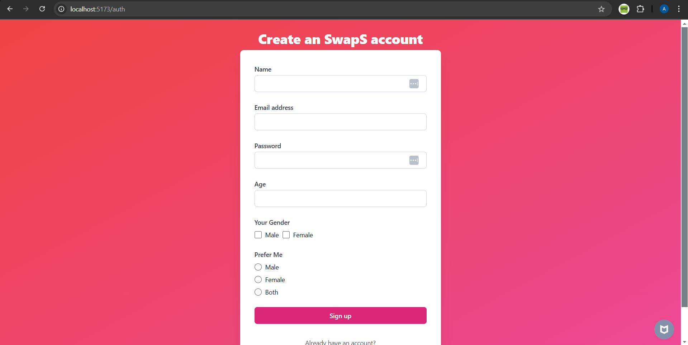
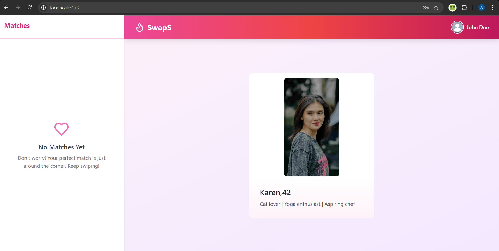
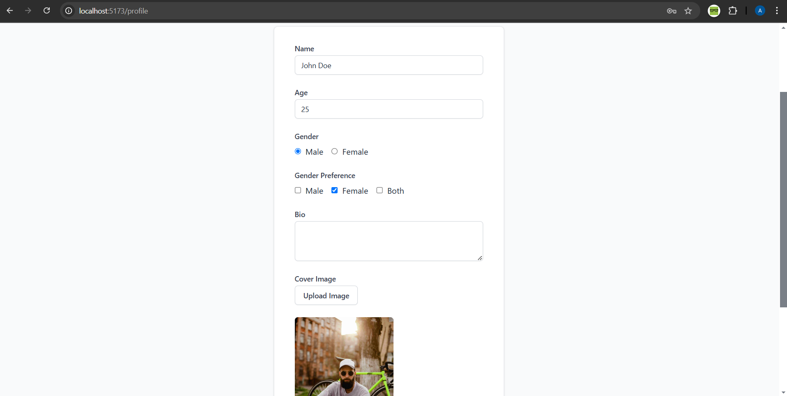
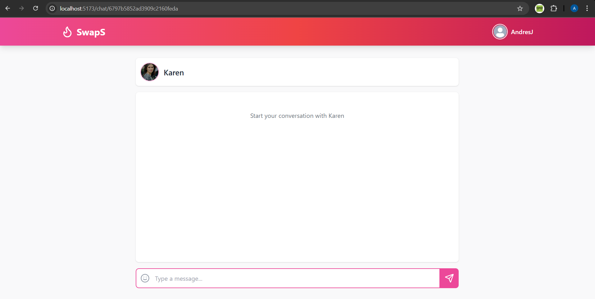

# Tinder-Clone

## Project Description
Tinder-Clone is a web application that mimics the functionality of the popular dating app Tinder. It allows users to create profiles, swipe on potential matches, and chat with other users in real-time.

## Features
- User authentication (sign up, log in, log out)
- Real-time messaging using Socket.io
- Profile creation and management
- Swipe functionality to match with other users

## Installation Instructions
To set up the project locally, follow these steps:

1. Clone the repository:
   ```bash
   git clone https://github.com/ANDRESGOM77/Tinder-Clone
   cd tinder-clone
   ```

2. Install the server dependencies:
   ```bash
   npm install
   ```

3. Navigate to the Client directory and install client dependencies:
   ```bash
   npm install --prefix Client
   ```

4. Build the client:
   ```bash
   npm run build --prefix Client
   ```

5. Start the server:
   ```bash
   npm run start
   ```
## Images







## Usage
After starting the server, you can access the application at `http://localhost:5000`. Follow the on-screen instructions to create an account and start swiping!

## Contributing
Contributions are welcome! Please fork the repository and submit a pull request for any changes or improvements.

## License
This project is licensed under the ISC License.
